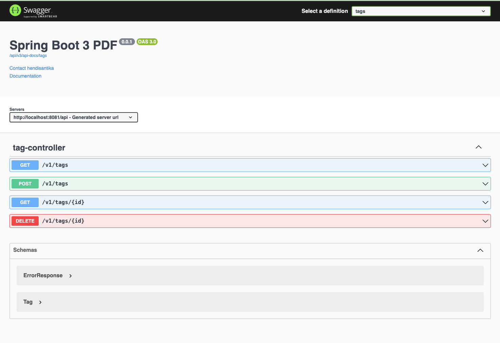

# spring-boot3-pdf-sample

### Things todo list

1. Clone this repository: `git clone https://github.com/hendisantika/spring-boot3-pdf-sample.git`
2. Navigate to the folder: `cd spring-boot3-pdf-sample`
3. Run the application: `mvn clean spring-boot:run`
4. Open your favorite browser: http://localhost:8081/api/swagger-ui

### Image Screenshots

Swagger UI

Authors

PDF

Posts

Tags

### Articles

1. https://www.baeldung.com/java-pdf-creation
2. https://www.baeldung.com/java-edit-existing-pdf
3. https://www.baeldung.com/java-watermarks-with-itext
4. https://refactoring.guru/design-patterns/chain-of-responsibility
